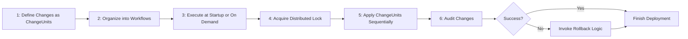

# How It Works?

Flamingock provides a structured, auditable, and version-controlled approach to managing changes across your systems, services, and configurations — simplifying the release process and reducing the risk of failure.

At a high level, here’s how Flamingock works:

---

## 1. Define your changes as ChangeUnits

Every change — whether it’s a database migration, a feature flag update, or a third-party API configuration — is encapsulated into a **ChangeUnit**.

- Each ChangeUnit is uniquely identified, versioned, and optionally includes rollback logic.
- Changes can be defined in code (Java/Kotlin) or declaratively (YAML/JSON) via reusable templates [**templates**](../docs/templates/templates-introduction.md).

---

## 2. Organize changes into Workflows

ChangeUnits are grouped into stages and structured into a [**Workflow**](overview/core-concepts.md?#🔄Workflows) pipeline to represent a coordinated sequence of changes.

- Workflows allow you to define how changes should be applied: sequentially or (in future releases) in parallel or conditionally.
- This logical grouping simplifies the orchestration and order of changes across systems / services / components.

---

## 3. Execute at startup (or on demand)

When your application starts, Flamingock automatically:

- Scans for pending ChangeUnits
- Applies them in the defined workflow order
- Ensures **idempotency** so the same changes aren't applied twice

Flamingock can also run in standalone mode, ideal for setups that don't use an underlying framework (ie. Spring).

---

## 4. Locking for safety in distributed environments

Using **distributed locking**, Flamingock ensures only one instance (or one node) applies changes at a time — preventing race conditions or duplicate executions.

- Works across microservices and distributed system setups
- Supports multiple store types:
  - Flamingock Community Edition, with native driver compatibility with MongoDB, Couchbase, DynamoDB
  - Flamingock SaaS or Flamingock self-hosted options to leverage Flamingock's provisioned storage.

---

## 5. Audit Everything, Rollback When Needed

Every change applied is **fully audited**:

- When, by whom, and what was changed
- Status of execution (success/failure)
- And a provisioned optional rollback strategy for non-transactional integrations.

In case of failure or rollback scenario, Flamingock uses defined compensating logic to revert changes and restore consistency.

---

## 🧪 Example Use Cases

### Example 1: Versioning Made Simple

Imagine a developer needs to introduce the following system changes as part of a release:

1. Add a new field to the user collection in MongoDB  
2. Enable a feature flag in a SaaS dashboard via REST API  
3. Update an environment variable in a remote configuration store

Here’s how Flamingock helps:

- The developer defines each change as an individual **ChangeUnit**, with rollback logic included.
- These ChangeUnits are grouped into stages and a embedded into a **workflow**, ensuring they run in the correct order.
- On the next application startup, Flamingock:
  - Detects that these changes haven’t been applied yet
  - Acquires a distributed lock
  - Executes all ChangeUnits safely and atomically
  - Logs every detail in the audit system

Flamingock rolls back automatically in case of failure(if defined), ensuring the system doesn’t end up in a partial state.

The result? Faster deployments, consistent environments, and complete traceability.

---

### Example 2: Synchronizing Changes Across Domain Services

In a Domain-Driven Design (DDD) environment, a change to a domain model often requires updates across several components:

1. Update to the Database and API specification (e.g., OpenAPI/Swagger)
2. Modify the Kafka event schema and topic configuration
3. Adjust the API Gateway routing and validation rules

Here’s how Flamingock makes this seamless:

- The team creates **ChangeUnits** for:
  - Updating the Database and  API specification
  - Reconfiguring Kafka topics and event schema
  - Updating API Gateway specs
- All related *ChangeUnits* are grouped into a single **workflow** to ensure coordinated application.
- During deployment, Flamingock:
  - Applies all changes atomically, respecting dependencies
  - Acquires a distributed lock to avoid concurrent modifications
  - Audits the entire process for traceability and compliance

This ensures that changes in the Database, messaging, and APIs exposed in the gateway are synchronized, reducing integration errors and deployment friction across microservices.

---

Flamingock helps development teams **release faster**, **with confidence**, and **without surprises**. It provides an auditable traceable system where all Changes are centrally managed.