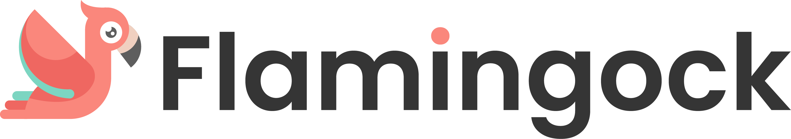

*The safety-first platform for distributed system evolution*
## The Flamingock Guarantee
**"Your system will always be left in a known, auditable, and consistent state — no matter what happens."**

Managing change across distributed systems is inherently complex — from database updates to API evolution, message queue configuration, and SaaS integrations. Traditional tools optimize for the "happy path," but real-world deployments face partial failures, network issues, and uncertain states.

**Flamingock** is the enterprise platform built for real-world chaos, providing safety-first distributed system evolution with complete audit trails and intelligent recovery strategies.

Built on **Change-as-Code** principles, Flamingock transforms how organizations evolve their systems:

- **Safety by default**: When uncertain, stop and alert rather than corrupt data
- **Complete audit trail**: Every action, success, and failure is tracked for compliance
- **Intelligent recovery**: Configurable strategies based on operation characteristics
- **Organizational impact**: Reduce team dependencies, accelerate releases, ensure governance

**Ready to modernize your change management?**  
[Get started](../getting-started/get-started.md) and see how Flamingock can power your release lifecycle.


.gif)

## Why Flamingock?

### Built for Enterprise Reality
While traditional tools assume perfect conditions, Flamingock is engineered for production environments where:
- **Networks fail mid-operation** - Flamingock tracks partial state and enables safe recovery
- **Systems are non-transactional** - Kafka, S3, REST APIs get first-class safety treatment  
- **Compliance is mandatory** - Complete audit trails with governance workflows
- **Teams need autonomy** - Developers control their domain without infrastructure dependencies

### Strategic Business Impact
Flamingock transforms organizational capabilities:

**Risk Reduction**
- Prevent silent data corruption through safety-first defaults
- Complete audit trails for regulatory compliance and incident response
- Intelligent recovery strategies eliminate guesswork during failures

**Team Velocity**  
- Eliminate deployment bottlenecks with autonomous change management
- Reduce cross-team dependencies through clear ownership boundaries
- Accelerate release cycles with confident, coordinated rollouts

**Operational Excellence**
- Centralized governance with distributed execution
- Real-time visibility across all system changes
- Automated compliance reporting and audit capabilities


## Enterprise Use Cases

Flamingock enables safe evolution across your entire technology stack:

**Data Systems**
- Database schema evolution (SQL/NoSQL)
- Data transformations and cleanup operations
- Index creation and optimization

**Infrastructure & APIs** 
- Message broker topic and schema management
- API gateway configuration and routing rules
- Cloud service provisioning and configuration

**Application Configuration**
- Feature flag rollouts and toggles  
- External SaaS provider setup and integration
- Security policy and permission updates

**Distributed System Coordination**
- Multi-service configuration synchronization
- Cross-system dependency management
- Environment-specific deployment customization

Flamingock provides enterprise-grade safety and audit capabilities for any system change that must evolve with your application.


## What Flamingock Is Not

**Infrastructure-as-Code Platform**: Flamingock operates within existing infrastructure, not provisioning it. We integrate with your existing cloud providers, databases, and services.

**Generic Batch Processing**: While powerful, Flamingock is optimized for deterministic, auditable changes that complete quickly, not long-running data processing jobs.

**CI/CD Replacement**: Flamingock integrates with your deployment pipeline but focuses specifically on safe system evolution, not build/test/deploy orchestration.

## How Flamingock Works

### Change-as-Code Architecture
Developers define system changes directly in application code using familiar programming constructs or declarative templates:

```java
@TargetSystem("user-database")
@ChangeUnit(id = "add-user-status", order = "001", author = "platform-team")
public class AddUserStatusField {
    
    @Execution
    public void execute(MongoDatabase database) {
        // Your change logic here - executed once, safely
        database.getCollection("users")
                .updateMany(new Document(), 
                           new Document("$set", new Document("status", "active")));
    }
    
    @RollbackExecution  
    public void rollback(MongoDatabase database) {
        // Compensation logic for governance and undo operations
        database.getCollection("users")
                .updateMany(new Document(), 
                           new Document("$unset", new Document("status", "")));
    }
}
```

### Enterprise Execution Lifecycle
1. **Automatic Discovery**: Flamingock scans your application for changes
2. **Safety Validation**: Checks audit store to prevent duplicate execution
3. **Intelligent Execution**: Applies changes with configurable recovery strategies
4. **Complete Audit**: Records execution details for compliance and troubleshooting
5. **Recovery Management**: Provides CLI tools for issue resolution and governance

### Built for Production Reality
- **Distributed-safe**: Prevents race conditions in clustered deployments
- **Network-resilient**: Handles partial failures with intelligent recovery
- **Compliance-ready**: Complete audit trails with governance workflows  
- **Version-locked**: Changes evolve with your application lifecycle  

👉 **Dive deeper:** | [How it works?](../getting-started/how-it-works.md)  | [Technical Overview](technical-overview.md) | [Quickstart Guide](../getting-started/get-started.md)